<div align="center">
<h1>L∞PS: A Python Ralph Harness</h1>
<p>Easy scaffold for a gated autonomous agent loop ("Ralph"). No task list and no orchestrator. A dumb Ralph tells an agent "Go!" and hands it a PROMPT. The agent iterates as many times as Ralph makes it. One iteration includes pre-commit gate rules enforcement, specs update, and a push to Github.</p>


[](https://makeapullrequest.com)


[](https://github.com/sebmestrallet/absurd-badges)
[](https://github.com/sebmestrallet/absurd-badges)
</div>
___________
Agents update their spec and `PROJECT_STATUS` at the end of each iteration. How things get built: the agent's `PROMPT` tells it to pick a `spec`. The `specs/` says *what* to build. The agent in the loop decides *what next*. Humans update the **MASTER** `PLAN` that refresh `specs/`.

## Start a new project
Use with new Python projects or drop the harness and dependencies into an existing project.
1. Run `uv run ralph install <your-project-name>`. Names the project, installs dependencies, and sets up the git hook.
2. Write your grand vision into `docs/PLAN.md`.
3. Optionally add the first spec in `specs/`, or have an agent draft the first specs.
4. Put product code under `src/` and list new source directories in `pyproject.toml [tool.coverage.run]`.
5. Strict Ruff rules, type checking, semgrep, and test coverage are set in `pyproject.toml`.
6. Your coding quirks go in `harness/preferences.py`.
7. Run a loop:
```sh
harness/ralph.sh [max_iterations] [max_minutes] <worker-agent>  # prompt-injected
```


```sh
# e.g. for Claude, Codex, or Gemini
harness/ralph.sh 10 20 claude -p --permission-mode acceptEdits
harness/ralph.sh 10 20 codex exec --json --sandbox workspace-write -
harness/ralph.sh 10 20 gemini --yolo
```
## A l∞p
The repo is the only memory between iterations. Each iteration is a fresh-context agent.
- `specs/` say WHAT to build
- `PROMPT.md` is the standing instruction every iteration
- `PROMPT.md` tells agent: read `specs/`, review `src/`, build the most important unfinished thing
- agent builds
- agent commits
- every git commit passes the fast gate (lint, format, plus loop containment for the agent)
- every git push runs the full verify: types, semgrep, tests, 100% coverage
- The loop stops at `max_iterations`, a nonzero worker exit, or a timeout.
- Unspecified iterations/minutes → default to 2 iterations × 20 minutes each
- Run history lands in `scratchpad/ralph_runs.tsv`; per-iteration logs in `scratchpad/runs/`
- **The harness is worker-agnostic.** Any agent CLI that reads a prompt from stdin and can edit/commit works.



- There are NO worktrees by design. Agent duties can be spec'd and contained to a part of the repo. e.g. Codex-1-frontend, Claude-2-researcher, Codex-3-backend...
- This choice was made:
    1. For simplicity and maintainability of the framework.
    2. Because a fresh iteration can't see unmerged work in another worktree, so agents miss context and scramble to merge while conflicts pile up.
    3. Change this behavior if you're comfortable with granting agents full machine access, feeding context to agents, and managing rapidly moving git history.

## Safety

`harness/ralph.sh` launches an autonomous LLM worker with the permissions you grant it (e.g.
`--permission-mode acceptEdits`). The gate bounds what any **commit** may touch, but the worker itself is **not** sandboxed to this repo — under a permissive mode it can run arbitrary shell. You are authorizing real changes — choose the worker and permission mode deliberately. Run `uv run ralph status` for the run registry as a table; per-iteration logs are in `scratchpad/runs/`. Use `git log --oneline origin/main..HEAD` to show what's unpushed.

#### The Gate: Tiered Checks

The safety minimum is in code: `harness/gate.py` holds `PROTECTED_PATHS` and `FORBIDDEN_PATTERNS`, `semgrep` comes from `pyproject.toml`; `harness/preferences.py` holds the style checks other tools can't catch e.g. `MAX_FUNCTIONS_PER_FILE`. Containment runs when `RALPH_LOOP=1` and which `ralph.sh` sets at each invocation. Humans commit normally while agents in the loop get stronger checks.

⚡ `uv run ralph gate ` (pre-commit) → fast checks.
Ruff lint + check format for everyone, _plus_ **containment** for the agents (via `RALPH_LOOP=1` set by `ralph.sh`): `PROTECTED_PATHS` + `FORBIDDEN_PATTERNS` + preferences (incl. `MAX_FUNCTIONS_PER_FILE`).

✅ `uv run ralph verify` (pre-push) → the heavy quality pass: ruff lint + check format, pyright, pylint, semgrep, pytest @ 100% cov — no containment re-check. CI re-runs these quality checks on every PR and every push to `main` as the backstop.

Humans can use normal `git` commands.

Protected paths — `AGENTS.md`, `harness/`, `tests/harness/`, `.githooks/`, `.github/`,
`pyproject.toml` - are off-limits; humans own them.

## Layout

```
harness/        the gate, the loop (ralph.sh), the floor, the CLI    (protected)
tests/harness/  the harness's own tests                              (protected)
.githooks/      pre-commit / pre-push gate hooks                     (protected)
.github/        CI that re-runs the gate                             (protected)
pyproject.toml  project + tooling config                             (protected)
AGENTS.md       rules for agents working in the repo                 (protected)
PROMPT.md       the standing per-iteration instruction
specs/          WHAT to build, one PRIORITY-bannered file per track
src/            your product/source code (add to coverage source)
docs/           PLAN, INTERFACES, RESEARCH; PROJECT_STATUS
scratchpad/     scratch dir agents are pointed at for temp files
```

## ⚠️ Warnings. Read this before a first run.

1. **The gate is a guardrail, not a jail.** Agents are smart and crafty — like people. They will find a way to complete a task at all costs. Lock the worker down with its own settings (permissions and sandbox flags), add branch protection and required CI, and **trust nothing and no one.**

2. **This harness does not sandbox your machine.** It *tries* to contain the loop — the gate limits which paths a commit may touch, bans escape-hatch patterns, and steers writes into repo `scratchpad/`. But a worker can still run arbitrary shell commands. For real isolation, constrain all agents from a higher level, use permission/deny rules, or run everything in a container.

3. **Mind your usage limits.** `ralph.sh` works to a cap. If you set caps high, or run several workers from the same provider at once, you will burn through your tokens, context windows, and provider usage limits. **Workers keep working as long as there is work to do.** There is always work to do. Recall defaults: **2 loops x 20 minutes**.

4. **Every single iteration is a push** to whichever branch set by design, so autonomous commits push to remote continuously. **If you want to protect `main`, run the loop on its own branch and merge via PR/CI** — a protected `main` rejects the push and stalls the loop.

5. **100% coverage does not mean good tests.** That is quantity, not quality. If you had the same agents that wrote the code write the tests "green" can mean nothing. Tests should challenge source. _(You can try adding mutmut and run tests with `uv run --no-sync mutmut run` but v.3.6.0 has a bug triggered by test_cli.py.)_

## For agents

· Rules: `AGENTS.md` · What to build: `specs/` · Standing instruction: `PROMPT.md` ·

Use your best judgement · Leave the code how you would like to find it ·

Human and agent-owned status interface: `docs/PROJECT_STATUS.md`.
